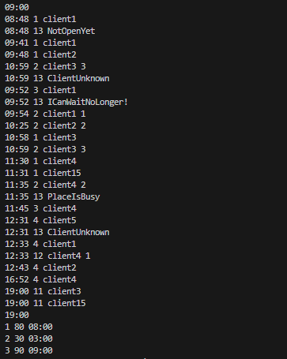

# Yadro_test_2 (на доработке)

- Нерабоче :
1. более 3 клиентов в очереди не генерит 11ID
2. Время округляется и выводит целым цислом (реализовать по минутам)
3. 11ID генерит не в алфавитном порядке

...


### Компиляция:

```sh
g++ main.cpp -o task
```
### Запуск:

```sh
./task text2.txt
```

### Пример вывода:

- для файла test2.txt


- для файла test.txt


